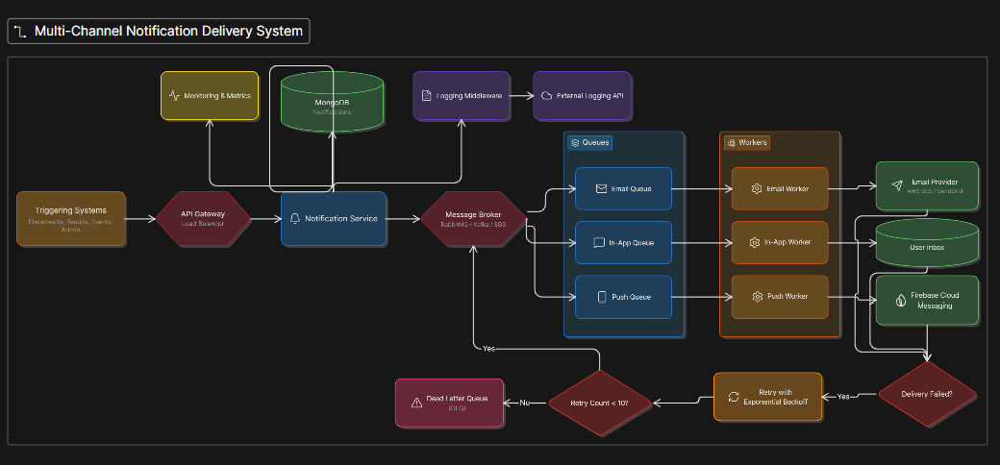

# Notification System Design Document

## Stage 1 — API Design
Endpoints to manage notifications:
- `GET /notifications`: Retrieve a paginated list of notifications for the authenticated user.
- `PATCH /notifications/:id/read`: Mark a specific notification as read by ID.
- `PATCH /notifications/read-all`: Mark all unread notifications as read for the user.

## Stage 3 — Database Indexing
Using MongoDB, we add a compound index to efficiently query notifications by user and unread status, sorted by recency:

```javascript
db.notifications.createIndex({ user_id: 1, is_read: 1, timestamp: -1 });
```

## Stage 4 — Pagination
Pagination will be implemented using cursor-based pagination for high performance and consistency:
- `limit`: The maximum number of notifications to return per page.
- `cursor`: A pointer to the last item of the previous page (e.g., the last `_id` or `timestamp`), ensuring new records added during pagination do not shift the offset.

## Stage 5 — Async Delivery
To ensure high availability and scalability, notifications will be delivered asynchronously using a queue-based architecture:
1. **Producer**: The API or triggering service pushes a notification payload to a Message Queue (e.g., RabbitMQ, Kafka, or Redis/BullMQ).
2. **Message Queue**: Buffers the incoming notifications, decoupling the creation process from delivery.
3. **Workers**: Independent background worker processes consume messages from the queue and interface with external providers (Email, SMS, Push) to deliver them.
4. **Retries & Failure Handling**: If a delivery fails, workers can utilize a dead-letter queue (DLQ) or exponential backoff to requeue the message for retry without blocking the main flow.

LLD:
